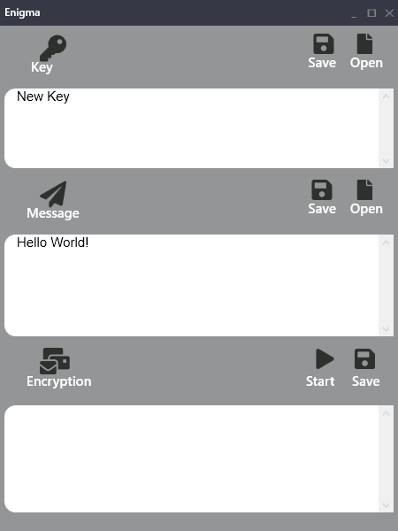

# Enigma_Cipher
## Description
___
A windowed application written in C # using the WPF framework and the MVVM design pattern.
The main purpose of the application is to encrypt and decrypt text using the XOR encryption algorithm.
___

____
## Purpose of creating the application
* Learning the WPF framework.
* Exploring the MVVM design pattern.